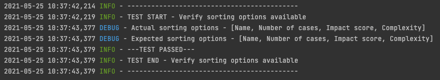
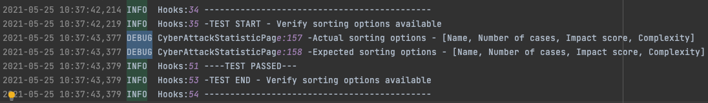
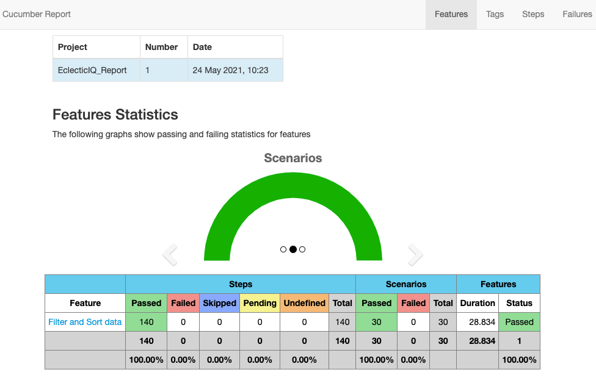
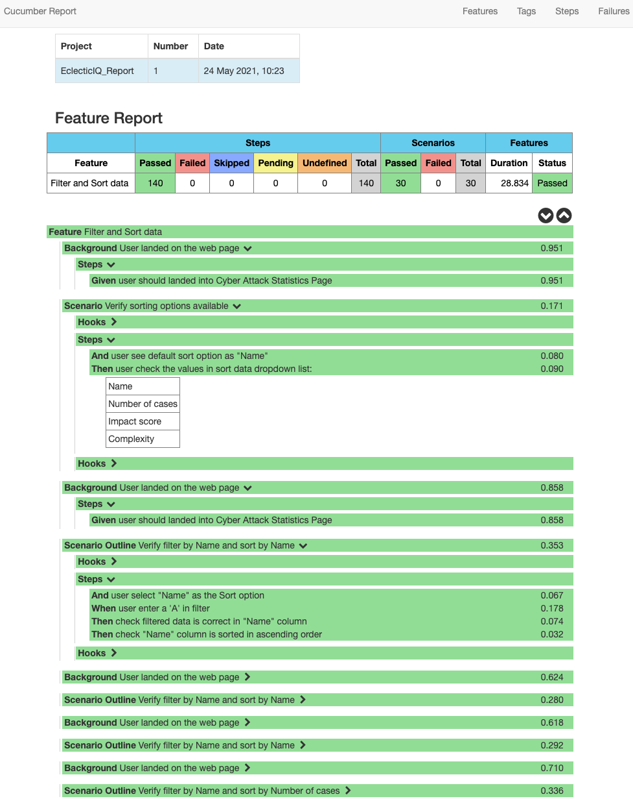
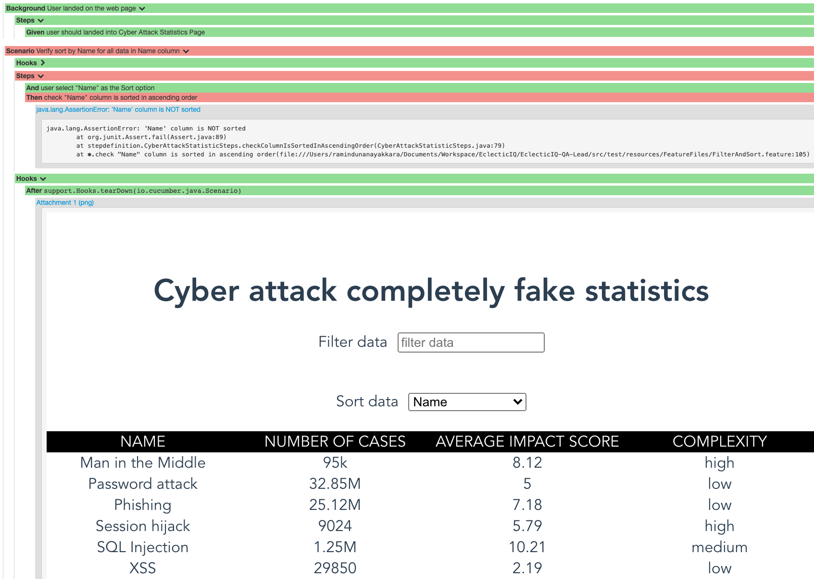

# EclecticIQ-QA-Lead

~~~~
# Important
Make sure you have JAVA 8 or above installed to run this test
~~~~

### Technologies

    Jave
    Selenium
    Cucumber
    log4j2
    Maven

### Default properties

    Default.properties file can be found in the root directoy.
       - Make sure you confirgure the webdriver path as for your OS(Windows/Mac).
       - Define the browser type(CHROME/FIREFOX) as for your requirment. Only one browser can run at a once.
       - Browser mode can be set to headless.

### Run Test

    To run all the test and generate report in target directory(cucumber-report-html)
        Run 'install' using maven Intellij IDEA plugin or if maven is install locally run the below commond in the terminal by going to the root directory.
        'mvn clean install'

### Logs

Will be created under the **logs** directory in root 

Sample console log

Sample log file with class info.

### Reports

Overview

Feature view with scenario and steps

Example fail scenario

    
