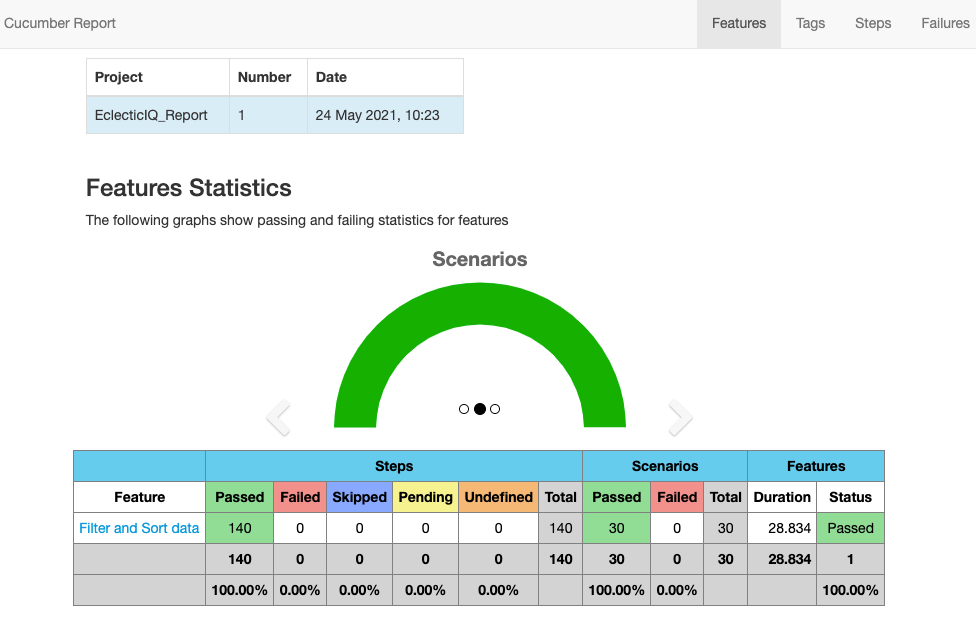
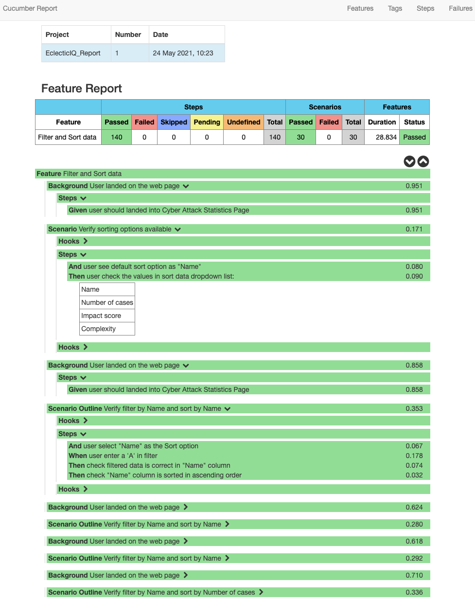
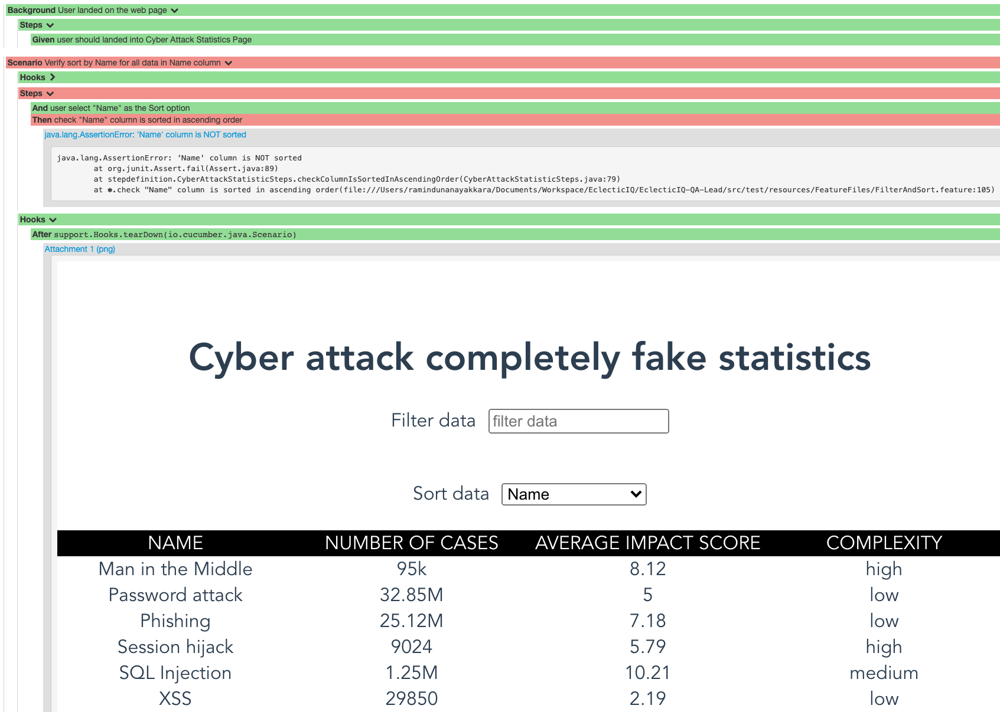

# EclecticIQ-QA-Lead

~~~~
# Important
Make sure you have JAVA 8 or above installed to run this test
~~~~

### Technologies
    Jave
    Selenium
    Cucumber
    log4j2
    Maven

### Run Test
    mvn clean install

### Logs
Will be created under the **logs** directory

### Reports

######Overview

######Feature view with scenario and steps

######Example fail scenario

    